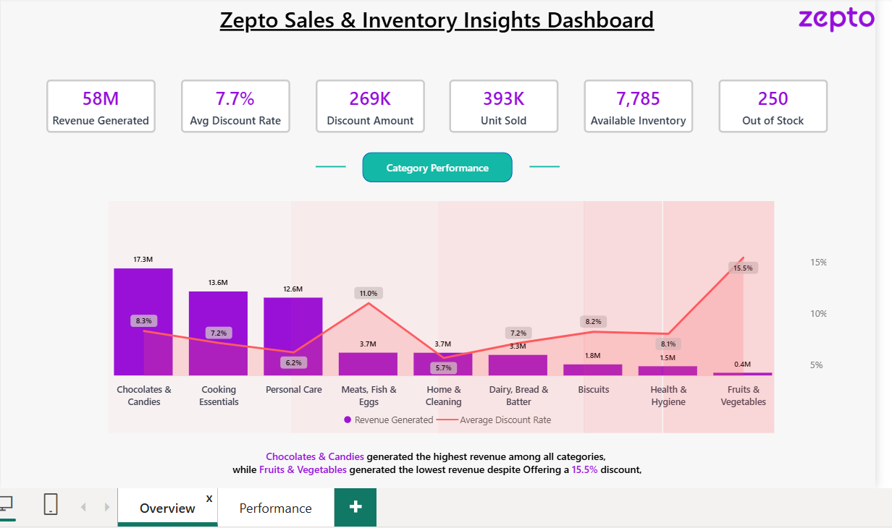

# 🛒 Zepto Sales & Inventory Insights Dashboard

A comprehensive Power BI dashboard designed to analyze Zepto's sales performance, inventory status, product performance, discount impact, and category-wise business insights.

---

## 📑 Table of Contents

- [Project Overview](#-project-overview)
- [Dashboard Objectives](#-dashboard-objectives)
- [Dataset Overview](#-dataset-overview)
- [Dashboard Pages](#-dashboard-pages)
  - [Overview Page](#1-overview-page)
  - [Performance Page](#2-performance-page)
- [Key KPIs](#-key-kpis)
- [Overview Dashboard Insights](#-overview-dashboard-insights)
- [Performance Dashboard Insights](#-performance-dashboard-insights)
- [Product Analysis](#-product-analysis)
- [Inventory Analysis](#-inventory-analysis)
- [Business Recommendations](#-business-recommendations)
- [Tools & Technologies Used](#-tools--technologies-used)
- [Project Learnings](#-project-learnings)
- [Dashboard Screenshots](#-dashboard-screenshots)
- [Conclusion](#-conclusion)

---

# 📊 Project Overview

The Zepto Sales & Inventory Insights Dashboard provides a complete analysis of sales, inventory, discounts, and product performance across multiple categories.

The dashboard helps stakeholders:

- Monitor revenue generation
- Track inventory levels
- Identify top-performing products
- Analyze discount effectiveness
- Reduce stock-out situations
- Improve category performance

---

# 🎯 Dashboard Objectives

The primary objectives of this dashboard are:

- Analyze category-wise revenue performance
- Track product sales trends
- Monitor inventory availability
- Evaluate discount strategies
- Identify top and low-performing products
- Reduce out-of-stock products
- Improve overall supply chain efficiency

---

# 📂 Dataset Overview

The dataset contains information related to:

| Column |
|----------|
| Product Name |
| Category |
| Revenue |
| Quantity Sold |
| Discount Rate |
| Discount Amount |
| Inventory Available |
| Stock Status |
| Product Weight |

---

# 📄 Dashboard Pages

## 1. Overview Page

The Overview page presents high-level business metrics and category performance.

### Features

- Revenue Generated
- Average Discount Rate
- Discount Amount
- Units Sold
- Available Inventory
- Out of Stock Count
- Category-wise Revenue Analysis
- Discount Impact Analysis

---

## 2. Performance Page

The Performance page focuses on detailed product and inventory performance.

### Features

- Top Performing Products
- Low Performing Products
- Quantity Sold Analysis
- Category Performance Overview
- Stock Status Analysis
- Product Weight Distribution

---

# 📌 Key KPIs

| KPI | Value |
|--------|--------|
| Revenue Generated | 58M |
| Average Discount Rate | 7.7% |
| Discount Amount | 269K |
| Units Sold | 393K |
| Available Inventory | 7,785 |
| Out Of Stock Products | 250 |

---

# 📈 Overview Dashboard Insights

### Revenue Performance

- Chocolates & Candies generated the highest revenue.
- Cooking Essentials ranked second in revenue generation.
- Personal Care contributed significantly to total sales.

### Discount Analysis

- Fruits & Vegetables received the highest discount rate (15.5%).
- Higher discounts did not always result in higher revenue.

### Category Observation

- Revenue declines significantly after the top three categories.
- Some categories require optimization despite aggressive discounting.

---

# 🚀 Performance Dashboard Insights

### Product Performance

Top Revenue Generating Product:

**Praakritik Natural Desi Ghee**

Key Observation:

- Consistently generates the highest revenue.
- Outperforms other products by a significant margin.

---

# 🏆 Product Analysis

### Top Performing Products

- Praakritik Natural Desi Ghee
- Dove Daily Care
- Godrej Yum Products
- Sunsilk Products
- Whiskas Kit Products

### Low Performing Products

- Banana Leaf
- Chakaach Products
- Cabbage
- Brinjal Products

### Business Impact

Understanding top products helps:

- Increase stock allocation
- Improve forecasting
- Maximize profitability

---

# 📦 Inventory Analysis

### Current Stock Status

| Status | Percentage |
|----------|------------|
| In Stock | 87% |
| Out Of Stock | 13% |

### Observations

- Inventory management is generally stable.
- A small portion of products requires immediate replenishment.
- Reducing stock-outs can improve customer satisfaction.

---

# 💡 Business Recommendations

### Revenue Growth

- Increase focus on high-performing categories.
- Expand inventory for best-selling products.

### Inventory Optimization

- Implement automated replenishment alerts.
- Maintain safety stock levels.

### Discount Strategy

- Reassess categories with high discounts but low revenue.
- Use targeted promotional campaigns.

### Product Strategy

- Promote top-performing products.
- Review low-performing product assortment.

---

# 🛠 Tools & Technologies Used

### Data Visualization

- Power BI

### Data Processing

- Power Query
- DAX

### Data Source

- Excel / CSV Dataset

### Dashboard Design

- KPI Cards
- Bar Charts
- Line Charts
- Pie Charts
- Tables
- Interactive Filters
- Bookmarks

---

# 📚 Project Learnings

Through this project, I learned:

- Data Modeling
- DAX Calculations
- KPI Design
- Dashboard Storytelling
- Inventory Analytics
- Business Intelligence Reporting
- Power BI Visualization Best Practices

---

# 🖼 Dashboard Screenshots

<p align="center">
  
  
</p>

<p align="center">
  
</p>

---

# ✅ Conclusion

The Zepto Sales & Inventory Insights Dashboard provides a comprehensive view of sales and inventory operations. It enables decision-makers to identify revenue opportunities, optimize inventory levels, improve discount strategies, and enhance overall business performance.

The dashboard successfully transforms raw transactional data into actionable business insights for data-driven decision-making.
````

## 📂 GitHub Repository Structure

```text
Zepto-Sales-Inventory-Dashboard/
│
├── README.md
├── Dashboard/
│   └── Zepto Sales & Inventory Dashboard.pbix
├── Dataset/
│   └── zepto_dataset.xlsx
├── Assets/
│   ├── Dashboard Banner.png
│   ├── Overview Dashboard.png
│   └── Performance Dashboard.png
└── Documentation/
    └── Project Report.pdf
```
